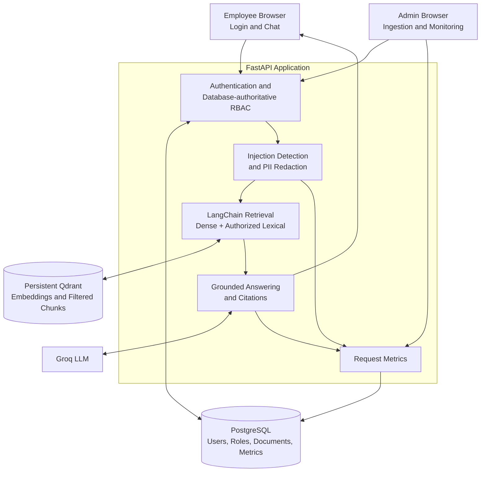

# Secure Enterprise RAG System

A secure enterprise RAG assistant that answers questions from internal company knowledge while enforcing role-based access control before retrieved context reaches the LLM.

## Why this project

Standard RAG pipelines can retrieve sensitive content before authorization is applied. This project treats authorization as part of retrieval, then measures retrieval quality, grounding, refusals, and access-control behavior.

## Key features

- Six-role, database-authoritative RBAC for employee, HR, finance, engineering, marketing, and admin users
- Server-side Qdrant category filtering before context reaches the LLM
- LangChain document loading and Markdown-aware chunking
- MiniLM embeddings with dense retrieval and authorized lexical support
- Grounded Groq answers with structured citations and evidence-based refusal
- Prompt-injection blocking and PII redaction
- Checksum-based idempotent ingestion
- PostgreSQL request metrics and admin monitoring
- Responsive FastAPI/Jinja frontend
- Persistent Docker Compose deployment
- Ragas evaluation and retrieval benchmarking

## High-level architecture



## Secure query flow

1. The server authenticates the JWT cookie and reloads the user and role from PostgreSQL.
2. Deterministic guardrails block prompt injection and redact supported PII patterns.
3. The role-to-category policy derives the user's allowed categories; client-supplied roles are never trusted.
4. Qdrant applies the category filter during retrieval, followed by authorized lexical support and evidence checks.
5. Insufficient evidence returns a refusal; otherwise, only authorized, redacted context is sent to Groq.
6. The response includes structured citations, while request metrics are stored without raw prompts or document text.

## Tech stack

| Layer | Technologies |
|---|---|
| Application | Python, FastAPI, Jinja2, vanilla JavaScript |
| Authentication | JWT, HttpOnly cookies, Argon2 password hashing |
| Retrieval | LangChain, sentence-transformers/all-MiniLM-L6-v2, Qdrant |
| Generation | Groq |
| Persistence | PostgreSQL, SQLAlchemy, Alembic |
| Evaluation | Pytest, Ragas, retrieval benchmark suite |
| Runtime | Docker, Docker Compose |

## Evaluation results

The frozen retrieval benchmark contains 28 authorization-aware cases.

| Metric | Result |
|---|---:|
| Hit@1 | 0.8500 |
| Hit@3 | 0.9500 |
| Mean Reciprocal Rank | 0.9042 |
| Expected-source accuracy | 1.0000 |
| Refusal-decision accuracy | 1.0000 |
| Category-authorization accuracy | 1.0000 |
| Unauthorized retrieval rate | 0.0000 |
| Median retrieval latency | 36.90 ms |
| p95 retrieval latency | 46.33 ms |

Ragas 0.3.9 evaluated 10 answerable cases; two no-context refusal cases were excluded from answer-quality scoring.

| Metric | Result |
|---|---:|
| Faithfulness | 0.7500 |
| Answer relevancy | 0.7490 |
| Context precision | 0.7833 |

The complete test suite last verified at **71 passed**. Detailed artifacts are available in the [retrieval benchmark report](benchmark/report_optimized.md) and [Ragas report](evaluation/report_optimized.md).

## Local setup

Requirements: Python 3.12 and PostgreSQL. Configure `.env` before running migrations; the example local database port is `5433`.

```powershell
Copy-Item .env.example .env
python -m pip install -e ".[dev]"
python -m alembic upgrade head
python -m app.seed
uvicorn app.main:app --reload
```

Open `http://localhost:8000`, sign in with a development account, and call `POST /api/documents/bootstrap` as an admin to index the bundled fictional FinSolve data. The data is attributed to [Codebasics FinSolve](https://github.com/codebasics/ds-rpc-01/tree/main/resources/data).

## Docker setup

Set secure values in `.env`, including `POSTGRES_PASSWORD`, before starting the stack.

```powershell
Copy-Item .env.example .env
docker compose up --build -d
docker compose exec app python -m app.seed
```

Compose runs database migrations at application startup and persists PostgreSQL and Qdrant data in named volumes. After admin bootstrap, verify readiness at `http://localhost:8000/health/ready`. Stop services without deleting data using `docker compose stop`.

## Security design

- Roles and allowed categories come from the authenticated database user and one centralized policy.
- Authorization is applied inside the Qdrant query, with response-layer validation as defense in depth.
- Passwords use Argon2 hashing; JWTs are stored in HttpOnly, SameSite=Lax cookies.
- Prompt injection is rejected before retrieval, and supported PII is redacted before external generation.
- Ingestion validates categories and uses checksums plus deterministic point IDs to prevent duplicates.
- Ingestion and monitoring endpoints require admin access; logs and metrics exclude raw prompts, secrets, and document content.

## Limitations

- Prompt-injection detection and PII redaction are deterministic controls, not complete classifiers.
- Evaluation uses a compact fictional enterprise corpus and does not establish production-scale performance.
- Embedded Qdrant and a single application process suit local and demonstration use, not horizontal scaling.
- Retrieval uses dense similarity with lexical support but no dedicated reranker.
- Answer generation depends on Groq availability, latency, and configured model behavior.
