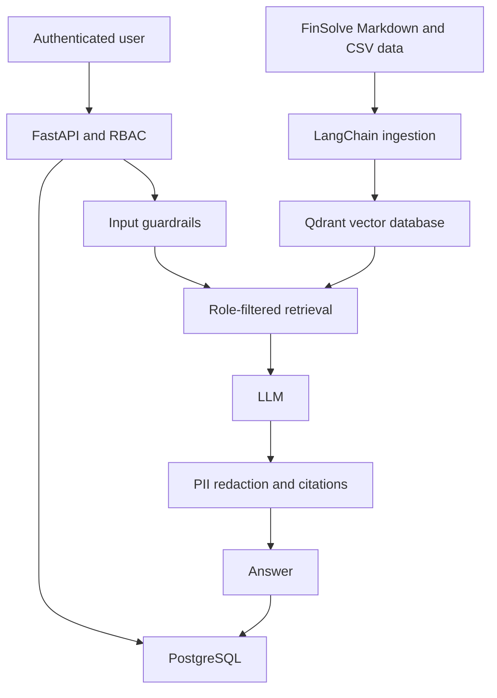
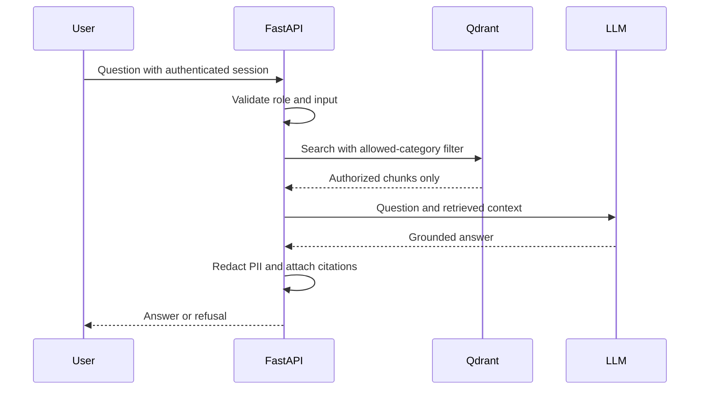

# Architecture

## Architectural style

The project is a single FastAPI application with clear internal modules. FastAPI serves the API and the Jinja-based web interface. PostgreSQL stores application data, while Qdrant stores embeddings and metadata for the Codebasics FinSolve company-document corpus.

LangChain is used for the RAG pipeline. LangGraph is intentionally not used because the request follows a direct sequence without an agent or cyclic workflow.

## High-level architecture



## Components

### Web interface

FastAPI renders simple Jinja pages for login, chat, document upload, and monitoring. Minimal JavaScript sends chat requests and displays answers and citations.

### Authentication service

The authentication module verifies passwords and issues JWTs. Every protected request validates the token and loads the current user from PostgreSQL.

The role stored in the database is authoritative. A role supplied in a request body is never trusted.

### Authorization service

A centralized mapping defines accessible categories:

```python
ROLE_CATEGORIES = {
    "employee": ["general"],
    "hr": ["general", "hr"],
    "finance": ["general", "finance"],
    "engineering": ["general", "engineering"],
    "marketing": ["general", "marketing"],
    "admin": ["general", "hr", "finance", "engineering", "marketing"],
}
```

This mapping is used to build the Qdrant metadata filter. Unauthorized chunks are excluded before prompt construction.

### Ingestion service

The ingestion service:

1. Loads the attributed Codebasics FinSolve corpus or validates an admin upload.
2. Calculates a checksum to prevent duplicate ingestion.
3. Loads Markdown using a text loader and CSV using LangChain's CSV loader.
4. Splits content into overlapping chunks.
5. Adds document metadata to every chunk.
6. Generates embeddings.
7. Stores chunks and vectors in Qdrant.
8. Stores document metadata and ingestion status in PostgreSQL.

Required chunk metadata:

```json
{
  "document_id": 15,
  "filename": "employee_handbook.md",
  "category": "general",
  "source_path": "general/employee_handbook.md",
  "chunk_index": 3,
  "section_or_row": "Leave Policy",
  "checksum": "sha256..."
}
```

### Retrieval service

The retrieval service receives the question and authenticated user. It converts the user's accessible categories into a Qdrant filter, performs similarity search, and returns the highest-ranking authorized chunks.

If the best results do not meet the configured relevance threshold, the service returns an insufficient-evidence result and does not call the LLM.

### Generation service

The LLM receives:

- a system instruction to answer only from supplied context;
- authorized retrieved chunks;
- the user's question.

It returns a concise answer. Citations are constructed from retrieved metadata rather than invented by the model.

### Guardrails

The first version uses simple, testable guardrails:

- Input pattern checks for obvious prompt-injection phrases.
- Retrieval threshold for unrelated or unsupported questions.
- Output regex redaction for configured PII patterns.
- Citation validation requiring cited sources to exist in retrieved results.

### Monitoring

The application stores one request-log row per chat request. It contains no document text and no password or JWT.

Stored fields include:

- user ID and role;
- request timestamp;
- latency;
- input and output token counts when available;
- retrieved document IDs;
- blocked or refused status;
- guardrail reason.

The admin dashboard displays basic aggregates from these rows.

## Data model

### User

- `id`
- `email`
- `password_hash`
- `role`
- `is_active`
- `created_at`

### Document

- `id`
- `filename`
- `category`
- `checksum`
- `status`
- `chunk_count`
- `uploaded_by`
- `created_at`
- `updated_at`

### ChatRequestLog

- `id`
- `user_id`
- `user_role`
- `latency_ms`
- `input_tokens`
- `output_tokens`
- `retrieved_document_ids`
- `was_blocked`
- `was_refused`
- `guardrail_reason`
- `created_at`

## Main API routes

| Method | Route | Access | Purpose |
| --- | --- | --- | --- |
| `POST` | `/auth/login` | Public | Authenticate and create a session |
| `POST` | `/auth/logout` | Public | Clear the session cookie |
| `GET` | `/auth/me` | Authenticated | Return the current database user |
| `GET` | `/api/admin` | Admin | Verify admin-only access |
| `POST` | `/api/chat` | Authenticated | Ask a question |
| `POST` | `/api/documents` | Admin | Upload and index a document |
| `POST` | `/api/documents/bootstrap` | Admin | Index the bundled FinSolve corpus |
| `GET` | `/api/documents` | Admin | List indexed documents |
| `GET` | `/api/monitoring/summary` | Admin | View request metrics |
| `GET` | `/health` | Public | Application health |

## Query sequence



## Suggested project structure

```text
app/
  main.py
  config.py
  database.py
  models/
  schemas/
  routes/
  services/
    auth.py
    authorization.py
    ingestion.py
    retrieval.py
    generation.py
    guardrails.py
    monitoring.py
  templates/
  static/
tests/
evaluation/
alembic/
sample_data/
  finsolve/
    general/
    hr/
    finance/
    engineering/
    marketing/
```

This structure separates responsibilities without splitting the application into separate services.
